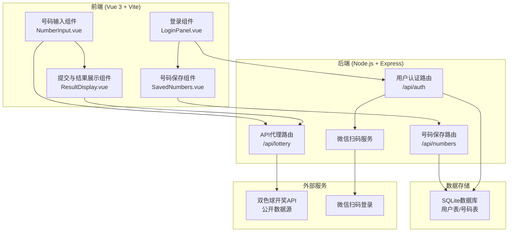

# 双色球中奖检查器

Feature Name: ssb-lottery-checker
Updated: 2026-05-14

## Description

中国福利双色球中奖检查Web应用，用户可输入最多10组号码与近20期开奖结果比对。已登录用户可保存号码组供下次使用。前端采用 Vue 3 + Vite 构建，后端提供 API 代理、用户管理和数据持久化服务。

## Architecture

前端通过 Vite 代理将 `/api` 请求转发至后端，后端负责：
- 代理开奖数据请求，避免 CORS 问题
- 处理微信扫码 OAuth 流程
- 持久化用户号码组数据

## Components and Interfaces

### 前端组件

#### NumberInput.vue
- 功能：提供号码组输入界面，最多10组
- 输入校验：红球 1-33 不重复，蓝球 1-16
- 接口：emit `submit` 事件，传递有效号码数组
- 状态管理：reactive 存储输入数据和错误信息

#### ResultDisplay.vue
- 功能：表格展示比对结果
- 数据接收：props 接收号码组和开奖数据
- 展示逻辑：计算中奖等级、高亮中奖单元格
- 汇总展示：总中奖次数、总奖金

#### LoginPanel.vue
- 功能：微信扫码登录入口
- 流程：请求后端获取二维码 -> 轮询登录状态 -> 成功后更新用户信息
- 状态：未登录/登录中/已登录

#### SavedNumbers.vue
- 功能：展示和管理已保存的号码组
- 操作：加载/删除/保存号码组
- 权限：仅登录用户可见

### 后端接口

#### GET /api/lottery/recent
- 描述：获取近20期开奖数据
- 响应：`{ periods: [{ period: string, red: number[], blue: number, date: string }], count: number }`

#### POST /api/auth/qrcode
- 描述：获取微信扫码登录二维码
- 响应：`{ qrcodeUrl: string, sceneStr: string }`

#### GET /api/auth/status?sceneStr=xxx
- 描述：轮询登录状态
- 响应：`{ status: 'pending' | 'scanned' | 'success' | 'expired', token?: string, user?: object }`

#### POST /api/auth/logout
- 描述：退出登录
- 请求头：`Authorization: Bearer <token>`
- 响应：`{ success: boolean }`

#### GET /api/numbers
- 描述：获取已保存的号码组
- 请求头：`Authorization: Bearer <token>`
- 响应：`{ numbers: [{ id: number, red: number[], blue: number, createdAt: string }] }`

#### POST /api/numbers
- 描述：保存号码组
- 请求头：`Authorization: Bearer <token>`
- 请求体：`{ numbers: [{ red: number[], blue: number }] }`
- 响应：`{ success: boolean }`

#### DELETE /api/numbers/:id
- 描述：删除已保存的号码组
- 请求头：`Authorization: Bearer <token>`
- 响应：`{ success: boolean }`

## Data Models

### User (用户表)
| 字段 | 类型 | 说明 |
|------|------|------|
| id | INTEGER | 主键 |
| openId | VARCHAR(64) | 微信openid，唯一索引 |
| nickname | VARCHAR(128) | 用户昵称 |
| avatar | VARCHAR(512) | 头像URL |
| token | VARCHAR(256) | 登录token |
| tokenExpiry | DATETIME | token过期时间 |
| createdAt | DATETIME | 创建时间 |
| updatedAt | DATETIME | 更新时间 |

### UserNumber (号码表)
| 字段 | 类型 | 说明 |
|------|------|------|
| id | INTEGER | 主键 |
| userId | INTEGER | 外键，关联User.id |
| redBalls | VARCHAR(32) | 红球，逗号分隔如 "01,05,12,18,25,30" |
| blueBall | INTEGER | 蓝球 1-16 |
| createdAt | DATETIME | 创建时间 |

### LotteryPeriod (开奖缓存表)
| 字段 | 类型 | 说明 |
|------|------|------|
| period | VARCHAR(16) | 期号，主键 |
| redBalls | VARCHAR(32) | 红球，逗号分隔 |
| blueBall | INTEGER | 蓝球 |
| drawDate | DATETIME | 开奖日期 |
| fetchedAt | DATETIME | 获取时间 |

## Correctness Properties

### 号码校验不变量
- 每组号码必须恰好包含6个红球
- 红球取值范围 [1, 33]，且互不重复
- 蓝球取值范围 [1, 16]
- 号码组总数不超过10组

### 中奖判定规则
| 等级 | 条件 | 奖金 |
|------|------|------|
| 一等奖 | 6红 + 1蓝 | 浮动（通常500万） |
| 二等奖 | 6红 + 0蓝 | 浮动（通常数十万） |
| 三等奖 | 5红 + 1蓝 | 3000元 |
| 四等奖 | 5红 + 0蓝 或 4红 + 1蓝 | 200元 |
| 五等奖 | 4红 + 0蓝 或 3红 + 1蓝 | 10元 |
| 六等奖 | 2红 + 1蓝 或 1红 + 1蓝 或 0红 + 1蓝 | 5元 |

### 数据一致性
- 用户删除后，关联号码组应级联删除
- 开奖数据缓存有效期不超过24小时
- Token有效期为7天

## Error Handling

### 前端错误处理
- 网络请求失败：显示 Toast 提示，提供重试按钮
- 号码格式错误：在输入框下方显示红色错误信息，定位到具体组别
- 登录超时：提示"登录已过期，请重新登录"，自动返回未登录状态
- 二维码过期：自动刷新二维码，显示"二维码已刷新"提示

### 后端错误处理
- 外部API不可用：返回 502，前端提示"开奖数据获取失败"
- Token无效：返回 401，前端清除本地状态
- 数据库异常：记录错误日志，返回 500，前端提示"服务暂时不可用"
- 微信登录异常：记录错误，返回具体错误码供前端展示

## Test Strategy

### 前端测试
- 单元测试：号码校验逻辑、中奖判定算法
- 组件测试：NumberInput 组件输入/验证流程、ResultDisplay 数据渲染
- E2E测试：完整用户流程（输入号码 -> 提交 -> 查看结果）

### 后端测试
- API测试：所有接口的正常/异常响应
- 集成测试：微信OAuth完整流程、号码组CRUD操作
- 数据测试：中奖判定规则覆盖率100%

## References

[^1]: 双色球规则 - [中国福利彩票](https://www.cwl.gov.cn/)
[^2]: Vue 3 文档 - [Vue.js](https://vuejs.org/)
[^3]: 微信扫码登录 - [微信开放平台](https://open.weixin.qq.com/)
